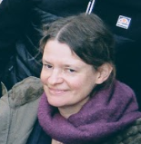

# Virginie Dourson

>_"Taking responsibility means never blaming anyone else for anything you are being, doing, having, or feeling."_       Suzan Jeffers

### Comprendre le monde qui m'entoure et ce que je fais me nourrit chaque jour.

|Bla|Bla|
|---|---|
|Birthday|11/08|
|Favorite color|red|
|Favorite food|chocolate|
|Pinneapple on pizza|yes no|

### Hobbies
- Walk :
    * in the nature
    * in the mountain (my favorite, but not possible in Belgium)
    * in a place charged with history
- Read :
    * novels
    * personal development
    * mangas

### You can always count on me when you have a question (if I'm able to help you, il will do it with pleasure), or when you are distressed and need some help (I would do all in my abilities to help you).

### A funny story
Quand j'était adolescente, j'étais partie vendre des calendriers pour les scouts avec ma soeur, et nous avions oublié de prendre la clé de la maison. Nos parents étant partis, nous nous sommes retrouvés devant porte close. Nos parents ne devaient rentrer que tard ce soir là. Nous avons alors tenté de rejoindre la fenêtre du 3ème étage qui était restée ouverte, en empilant des poubelles, et en passant par la terrasse, et ensuite un toit plat. Seulement nous nous sommes retrouvés coincées sur le toit plat, sans plus savoir ni monter ni descendre, car les poubelles étaient tombées. Nous avons donc dû patienter que nos parents rentrent le soir. Quand ils sont rentrés, ils ont entendu du bruit sur la terrasse et ont crû qu'il s'agissait d'un voleur :  ils ont appelé la police!
#### TL;DR
Quand j'était jeune, mes parents ont un jour appelé la police en croyant que j'étais un cambrioleur!

<<[Tim ](https://github.com/TimDesmet00/)|| Virginie ||[ Justine](https://github.com/Sheyleen)>>

